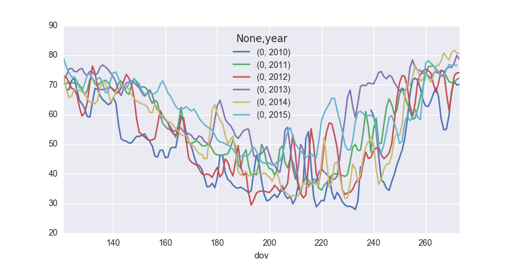

I wanted to compare several years of daily albedo observations to one another by plotting them on the same x (time) axis. You can do this by taking advantage of Pandas' pivot table functionality.

The data are contained in a pandas Series, indexed with `datetimes`:

```python
al_pd.head()
```
```
TIME
2010-05-01    73.538643
2010-05-02    65.370290
2010-05-03    69.298476
2010-05-04    70.018208
2010-05-05    76.632503
...
dtype: float64
```

First smooth the time series by taking the mean over a rolling triangular window of width 3 values:

```python
al_pd = al_pd.rolling(window=3, center=True, win_type='triang').mean()
```

Convert to a DataFrame and add two columns, one containing the day-of-year and the other the year:

```python
al_pd.name = 'Albedo'
al_pd = al_pd.to_frame()
al_pd['doy'] = al_pd.index.dayofyear
al_pd['Year'] = al_pd.index.year
```

The dataframe now looks like this:

```
               Albedo  doy  Year
TIME                            
2010-05-01  73.538643  121  2010
2010-05-02  65.370290  122  2010
2010-05-03  69.298476  123  2010
2010-05-04  70.018208  124  2010
2010-05-05  76.632503  125  2010
...
```

Finally create a pivot table, which will have a column for each year in the data set and a row for each day-of-year:

```python
piv = pd.pivot_table(al_pd, index=['doy'],columns=['Year'], values=['Albedo'])
```

This outputs a pivot table which looks like this:

```
         Albedo                                                       
Year       2010       2011       2012       2013       2014       2015
doy                                                                   
121   73.538643  71.156460  70.771080  69.188382  71.635948  78.025509
122   65.370290  68.695741  75.071027  74.486435  68.093146  75.218588
123   69.298476  73.066383  69.339166  74.673265  65.952841  75.665903
124   70.018208  69.254242  69.014770  77.758446  63.181904  70.147964
125   76.632503  71.679306  68.095796  72.417934  72.567538  74.658602
...
```

The pivot table is simple to plot:

```python
import seaborn as sns
piv.plot()
```

